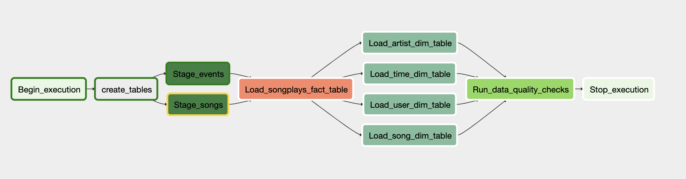

# Data Pipeline Airflow & AWS Redshift ETL

This project is run with Udacity docker container.

### Prerequisites :
1: Launch airflow by: /opt/airflow/start.sh
2: Set AWS connection:

 2.1: For AWS redshift, go to **Admin** -> **connections** -> **create**, fill all blanket. Choose **Postgres** in **conn_type**.
 
 2.2: For IAM credential setup, go to **Admin** -> **connections** -> **create**, fill **conn_id**, **login**(Your AWS access key ID), **password**(Your AWS secret access key).
      Choose **Amazon Web Services** in **conn_type**.

### S3 link for origin data:

-Log data: **s3://udacity-dend/log_data**

-Song data: **s3://udacity-dend/song_data**

The compagny Sparkify need to analyses theirs data to better know the way users (free/paid) use theirs services. With this data pipeline we will be able to schedule, monitor and build more easily the ETL of this data.

### Data Pipeline

